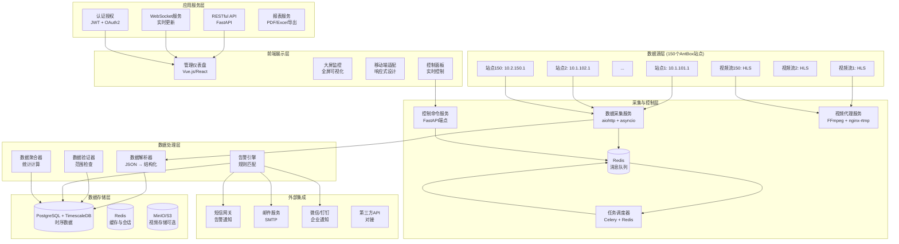

# 矿机冷却系统监控平台 - 系统架构设计

## 总体架构图



## 组件详细说明

### 1. 数据采集服务 (Data Collector)
- **技术栈**: Python aiohttp + asyncio
- **并发能力**: 150个站点并发采集，约5秒完成一轮
- **采集频率**: 可配置，默认60秒/次
- **容错机制**:
  - 连接超时处理（3秒超时）
  - 重试机制（最大3次）
  - 断点续传
  - 数据完整性验证

### 2. 控制命令服务 (Control Service)
- **协议**: RESTful API over HTTPS
- **命令队列**: Redis队列保证顺序执行
- **状态跟踪**: 每个命令有唯一ID，可查询执行状态
- **权限控制**: 基于角色的访问控制（RBAC）
- **审计日志**: 所有控制操作入库

### 3. 视频代理服务 (Video Proxy)
- **功能**: 代理HLS流，避免前端直接访问内网IP
- **技术**: nginx-rtmp-module + FFmpeg转码
- **特性**:
  - 实时转码（支持多种分辨率）
  - 访问控制（Token验证）
  - 带宽限制
  - 录制功能（可选）

### 4. 任务调度器 (Task Scheduler)
- **框架**: Celery + Redis作为Broker
- **任务类型**:
  - 定期数据采集
  - 告警检查
  - 数据清理
  - 报表生成
- **监控**: Flower监控任务状态

### 5. 数据存储设计
#### 5.1 PostgreSQL + TimescaleDB
- **主数据库**: 存储配置、用户、控制日志
- **时序数据库**: 状态快照（高性能时间序列查询）
- **分区策略**: 按时间分片（1天/片）
- **压缩策略**: 7天后压缩，节省存储空间

#### 5.2 Redis
- **用途**: 缓存、会话存储、消息队列
- **数据结构**:
  - Hash: 站点最新状态缓存
  - List: 命令队列
  - Set: 在线用户会话
  - Sorted Set: 告警优先级队列

### 6. 告警引擎 (Alert Engine)
- **规则引擎**: 支持复杂条件组合
- **告警级别**: 紧急、严重、警告、信息
- **通知渠道**: 邮件、短信、微信、钉钉
- **告警抑制**: 避免重复告警
- **自动恢复**: 条件恢复后自动清除告警

### 7. 前端架构
#### 7.1 技术栈
- **框架**: Vue 3 + TypeScript 或 React + TypeScript
- **状态管理**: Pinia 或 Redux Toolkit
- **UI组件库**: Element Plus 或 Ant Design
- **图表库**: ECharts 或 Apache ECharts
- **地图**: 可选，用于站点地理位置展示

#### 7.2 页面结构
1. **总览仪表盘** - 关键指标KPI、告警摘要、地图视图
2. **站点详情** - 单个站点的详细数据、历史趋势、控制面板
3. **实时监控** - 视频流网格展示（4×4、9×9布局）
4. **告警中心** - 告警列表、处理、统计
5. **报表中心** - 能效分析、运行报告、导出功能
6. **系统管理** - 用户管理、权限配置、系统设置

### 8. 安全设计
- **认证**: JWT Token + Refresh Token
- **授权**: RBAC（管理员、操作员、查看员）
- **网络隔离**: 前端通过API网关访问，不直连内网
- **数据加密**: HTTPS传输，敏感数据加密存储
- **审计日志**: 所有操作记录，不可篡改

## 部署架构

### 开发环境
```yaml
version: '3.8'
services:
  postgres:
    image: timescale/timescaledb:latest-pg14
  redis:
    image: redis:7-alpine
  api:
    build: ./backend
    depends_on: [postgres, redis]
  collector:
    build: ./collector
    depends_on: [redis]
  frontend:
    build: ./frontend
```

### 生产环境
- **高可用部署**: Kubernetes集群
- **负载均衡**: Nginx/Traefik
- **数据库**: PostgreSQL主从复制 + TimescaleDB集群
- **监控**: Prometheus + Grafana
- **日志**: ELK Stack（Elasticsearch, Logstash, Kibana）

## 性能指标

| 指标 | 目标值 | 说明 |
|------|--------|------|
| 数据采集延迟 | < 5秒 | 150个站点一轮采集时间 |
| API响应时间 | < 200ms | P95延迟 |
| 并发用户数 | 50+ | 同时在线操作 |
| 数据存储 | 90天 | 原始数据保留时间 |
| 系统可用性 | 99.9% | SLA目标 |

## 扩展性考虑

1. **水平扩展**: 采集服务可部署多个实例，通过Redis队列分配任务
2. **分片存储**: 站点数据可按区域分片存储
3. **插件架构**: 支持自定义数据处理器、告警规则
4. **API开放**: 提供OpenAPI文档，支持第三方集成

## 下一步实施计划

1. **第一阶段（2周）**: 基础架构搭建
   - 数据库部署与初始化
   - 数据采集服务原型
   - 基础API开发

2. **第二阶段（3周）**: 核心功能开发
   - 完整数据采集与存储
   - 基础前端仪表盘
   - 告警引擎

3. **第三阶段（2周）**: 控制与视频功能
   - 控制命令服务
   - 视频代理服务
   - 控制面板

4. **第四阶段（1周）**: 测试与优化
   - 性能测试
   - 安全测试
   - 用户体验优化

## 参考设计
- **类似系统**: 工业SCADA系统、IDC监控系统
- **设计原则**: 实时性、可靠性、可扩展性
- **用户体验**: 大屏友好、操作直观、响应迅速